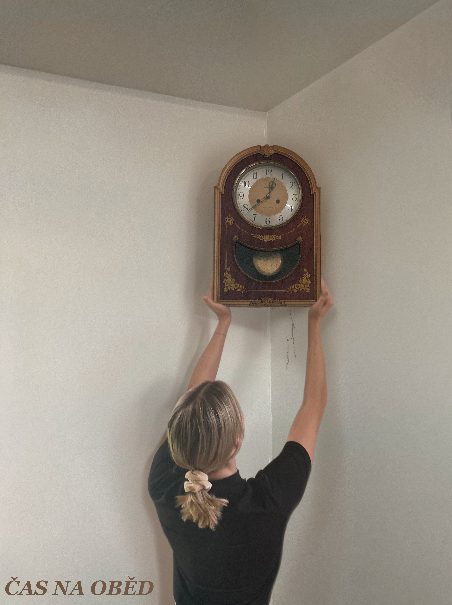

# MGA-gallery
Multimediální grafické aplikace - galerie semestrální práce

## Zadání
Semestrální práce měla 3 části:

    1. bitmapová grafika (Gimp) 
    2. vektorová grafika (Inkscape) 
    3. 3d grafika (Blender)

## Ukázka

