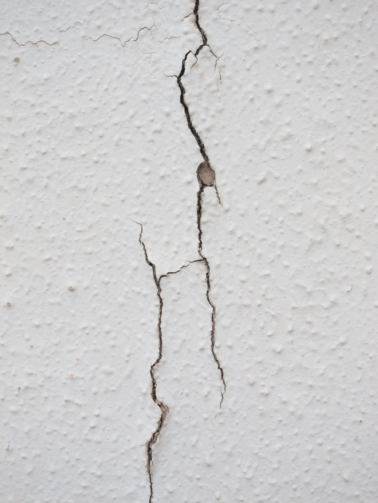
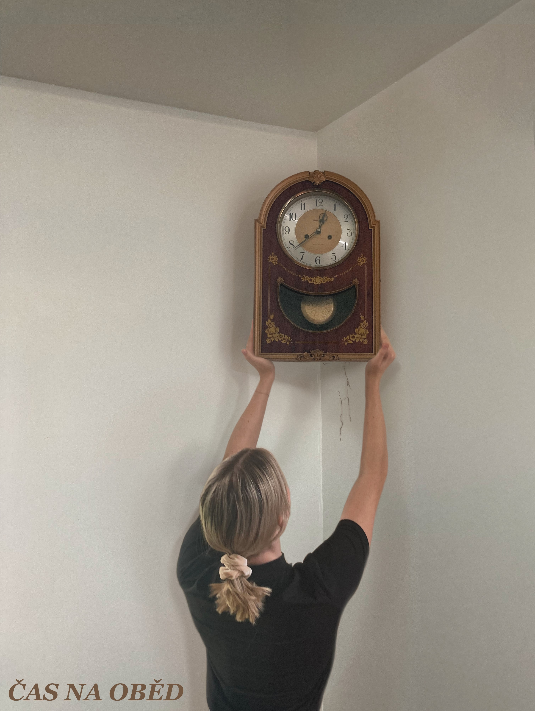

= Dokumentace Bitmapy

Jako téma jsem si vybrala staré kyvadlové hodiny. Pracovala jsem v probramu Gimp.

== Bitmapa 1

Výsledek se skládá za 3 částí - pozadí, artefaktu a osoby. Začala jsem s pozadím.

=== Úprava pozadí

Hodiny jsem chtěla posadit do rohu bílé zdi, protože tak mám vyfocenou i referenční fotku hodin. Bohužel jsem nenašla jednoduchou bílo rohovou zeď, tak jsem vyfotila rohovou zeď, která se opět láme, a rozhodla se ji upravit.

Úprava proběhla tak, že jsem zduplikovala část zalomené zdi , převrátila a napojila tak, aby stěna působila jednolitě.
Potom zbylo upravit strop. Ten jsem opět zkopírovala z části původní fotky, pak jen naškálovala a posunula na správnou pozici.

[cols="a,a,a,a,a", frame=none, grid=none]
|===
| image::bitmap/stena_puvodni.JPG[]
| image::bitmap/stena_mezikrok1.JPG[]
| image::bitmap/stena_mezikrok2.JPG[]
| image::bitmap/stena_mezikrok3.JPG[]
| image::bitmap/stena_mezikrok4.JPG[]
|===

=== Úprava artefaktu

Hodiny jsem pomocí maskování zbavila pozadí - tedy v masce jsem pečlivě objela objekt štětcem, který má měkké hrany (aby nevznikly tvrdé nepřirozené hrany).

Poté jsem je škálováním zmenšila na odpovídající velikost a umístila je na pozici do rohu stěny.
Také jsem upravila barvy pomocí barevných nástrojů: *odstín-barva:* snížení hue a chroma, zvýšení lightness, *jas a kontrast:* navýšení jasu i kontrastu, *vyvážení barev:* více do azurové, purpurové a modré, *upravení křivky:* tmavší barvy více tmavé, *sytost:* více sytější

Výsledkem jsou hodiny v rohu stěny.

[cols="a,a,a,a", frame=none, grid=none]
|===
| image::bitmap/hodiny_puvodni.JPG[]
| image::bitmap/hodiny_orez_tmave.JPG[]
| image::bitmap/hodiny_orez_maska.JPG[]
| image::bitmap/hodiny_orez.JPG[]
|===

Stíny jsem použila z pořízené fotografie hodin, takže jsem je upravila podobným způsobem.

Teoreticky jsem hodiny mohla rovnou ořezat i se stínem, ale tím, že jsem věděla, že možná budu chtít stíny zesvětlovat/ztmavovat nebo jinak barevně upravovat než samotné hodiny, rozhodla jsem se pro stíny udělat novou vrstvu.
Před barevnými úpravami hodin jsem si zduplikovala vrstvu s hodinami a upravila masku tak, aby obsahovala i stíny.

[cols="a,a", frame=none, grid=none]
|===
| image::bitmap/stiny_maska.JPG[]
| image::bitmap/stiny.JPG[]
|===

=== Úprava postavy

==== Ořez
Foto s postavou jsem vložila jako novou vrstvu.
Nejdříve jsem ji otočila naškálovala tak, aby seděla kompozice. Tedy aby postava byla přiměřeně veliká k hodinám a stěně, a aby vypadalo, že ruce podpírají hodiny.
Potom jsem opět pomocí masky odstranila pozadí postavy.

[cols="a,a,a,a", frame=none, grid=none]
|===
| image::bitmap/ja_puvodni.JPG[]
| image::bitmap/ja_original.JPG[]
| image::bitmap/ja_orez_maska.JPG[]
| image::bitmap/ja_orez_puvodni.JPG[]
|===

==== Barvy
Opět jsem upravovala barvy, aby stěna, hodiny a postava barevně ladily. Upravila jsem: *Jas a kontrast:* snížení jasu, *Sytost:* snížení sytosti, *Expozice:* snížení exposure.

Také jsem pomocí nástroje Zesvětlení/Ztmavení ztmavila části mého těla. Modře jsou označené vlasy - tam se hodně odráželo světlo.
Červeně jsou označené ruce - tam má ztmavení reprezentovat stíny, které vrhají hodiny.
Ztmavení rukou udělalo veliký rozdíl ve výsleku - vše dohromady působí přirozeněji.

Také jsem ještě upravila masku vrstvy - hrany byly moc ostré, takže jsem se snažilo o jemnější přechod.

[cols="a,a,a,a", frame=none, grid=none]
|===
| image::bitmap/ja_orez_puvodni.JPG[]
| image::bitmap/ja_orez_barvy.JPG[]
| image::bitmap/ja_orez_barvy_zvyraznene_stiny.JPG[]
| image::bitmap/ja_orez_tmavsi.JPG[]
|===

==== Stíny postavy

Stíny byly pro mě společně s barevnými úpravami nejtěžší.
Tím, že mám stát u rohové stěny, také tam budou dvojité stíny, které se mohou křížit.
Stíny jsem se inspirovala ze dvou referenčních fotek.

[cols="a,a", frame=none, grid=none]
|===
| image::bitmap/ja_puvodni.JPG[]
| image::bitmap/stiny_reference.JPG[]
|===

Nejdříve jsem udělala jemnější, světlejší stíny.
Malovala jsem je štětcem s neostrými hranami, a s vysokou průhledností - raději jsem navrstvila několik vrstev různými barvami.

Stíny rukou jsem se snažila napodobit podle referenčních obrázků. Stíny hlavy, jsem dělala podle vlastní představivosti.

[cols="a,a", frame=none, grid=none]
|===
| image::bitmap/ja_orez_tmavsi.JPG[]
| image::bitmap/ja_stiny_svetle.JPG[]
|===

Poté jsem přidala tmavší, ostřejší stíny. Zaměřila jsem se na stín levé ruky.
Tam jsem si do spodní vrstvy vložila referenční obrázek, který přibližně seděl kompozici a opět štětcem jako u světlých stínů jsem stín malovala ručně - teď tedy podle předlohy.
Výrazný stín jsem přidala za tělo na levé straně, kde by moje postava byla blízko zdi, a tedy vrhala ostrý stín.

[cols="a,a,a", frame=none, grid=none]
|===
| image::bitmap/ja_stiny_svetle.JPG[]
| image::bitmap/ja_stiny_reference_foto.JPG[]
| image::bitmap/ja_stiny_tmave.JPG[]
|===

=== Posunutí

Hodiny, stíny hodin, postavu a stíny postavy jsem si sloučila do jedné vrstvy a posunula níž, aby hodiny nebyly tak blízko stropu - to působilo nepřirozeně.

[cols="a,a", frame=none, grid=none]
|===
| image::bitmap/ja_stiny_tmave.JPG[]
| image::bitmap/posunute.JPG[]
|===

=== Popraskaná zeď

Jako vliv na prostředí jsem zvolila popraskání zdi.
Jako předlohu jsem zvolila obrázek z internetu.

https://bradleyrosherart.wordpress.com/2014/09/21/wall-drawing-design-cracks/[Zdroj obrázku]

Obrázek jsem vložila jako novou vrstvu, naškálovala a přesunula na místo, kde chci mít odřeninu.
Tenkým štětcem jsem nejdříve světle hnědou obtáhla škrábanec. Poté tmavší hnědou jsem zvýraznila tmavší místa.

[cols="a,a,a,a", frame=none, grid=none]
|===
| image::bitmap/ja_stiny_tmave.JPG[]
| image::bitmap/skrabanec_vlozene_foto.JPG[]
| image::bitmap/skrabanec_svetly.JPG[]
| image::bitmap/skrabanec_tmavy.JPG[]
|===

Přidala text: *písmo:* Yu Gothic UI Semi-Bold, velikost: 62, barva: hnědá

Uvážila jsem, že stíny osoby jsou moc světlé, takže jsem zduplikovala stíny co jsem vytvořila dříve a vložila je znovu s malou průhledností (podle toho, jak moc jsem chtěla stíny ztmavit).
Také stěna byla až moc bílá, takže jsem upravila barvy zvýšením teloty. A nakonec jsem ztmavila nejhlubší části popraskání zdi tmavě hnědou až černou barvou.

image::bitmap/bitmapa1finalni.png[]

== Bitmapa 2

=== Úprava pozadí

Opět jsem začala pozadím. To jsem použila z první bitmapy.

image::bitmap/bitmapa2stena.png[]

=== Úprava osoby

Vložila jsem fotku s postavou, naškálovala a posunula na požadované místo.
Přidala jsem masku a opět jako v první bitmapě jsem objetím objektu odstranila pozadí.
Opět jsem používala štětec s neostrými hranami, aby nevznikaly ostré hrany.

Byla jsem moc nasvícená, takže jsem potřebovala upravit barvy vrstvy.
Snížila jsem expozici, snížila jas a zvýšila kontrast.
Nástrojem zesvětlení/ztmavení jsem ztmavila místa, kde jsem chtěla zvíraznit stíny. (např. hrany ruky, vršek vlasů)

[cols="a,a,a", frame=none, grid=none]
|===
| image::bitmap/bitmapa_ja_maska.png[]
| image::bitmap/bitmapa_ja_orez.png[]
| image::bitmap/bitmapa_ja_tmava.png[]
|===

=== Úprava artefaktu

Vložila jsem fotku jako novou vrstvu a zmenšila škálováním, aby seděly proporce.
Maskováním jsem odstranila pozadí.

Stejně jako v první bitmapě jsem vyřešia i stíny hodin.
V nové vrstvě jsem maskováním smazala pozadí a nechala jen stíny s hodinami.
Chtěla jsem stíny ještě trochu ztmavit. Takže jsem si zduplikovala vrstvu se stínem hodin a trochu zprůhlednila.

[cols="a,a,a,a,a", frame=none, grid=none]
|===
| image::bitmap/bitmapa2_hodiny_maska.png[]
| image::bitmap/bitmapa2_hodiny_orez.png[]
| image::bitmap/bitmapa2_hodiny_stiny_maska.png[]
| image::bitmap/bitmapa2_hodiny_stiny_orez.png[]
| image::bitmap/bitmapa2_hodiny_stiny_tmave.png[]
|===

=== Stíny postavy

Stíny postavy jsem malovala štětcem s měkkými hranami do nové vrstvy.
Barvu jsem zvolila ze stínu hodin, aby působila co nejvěrohodněji.

[cols="a", frame=none, grid=none]
|===
| image::bitmap/bitmapa2_stiny.png[]
|===

=== Cedulka

Jedním z úkolů bylo vložit do bitmapy cedulku s textem.
Obdélníkový výběr jsem plechovkou vybarvila hnědou barvou.
Tento postup jsem opakovala s menším obdélníkem a tmavější barvou.
Vložila jsem text, který jsem pomocí pipety obarvila stejnou světejší barvou jako větší z obdélníků.

[cols="a, a", frame=none, grid=none]
|===
| image::bitmap/bitmapa2_cedulka.png[]
| image::bitmap/bitmapa2_cedulka_text.png[]
|===

[cols="a", frame=none, grid=none]
|===
| image::bitmap/bitmapa2_finalni.png[]
|===

